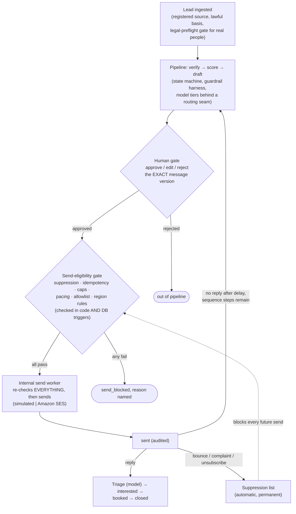

# RELAY

**Autonomous B2B prospecting and outreach — outbound that compounds,
engineered so the dangerous parts are structurally impossible.**

> **Status: prototype (2026-07-05).** The full roadmap (Phases 0–4) is
> code-complete — 331 tests against real Postgres, a live SES-sandbox
> send smoke on record — and the deliberately-skipped operator/legal
> items and go-to-production checklist are in
> [docs/prototype-status.md](docs/prototype-status.md). Read that first
> if you are picking the project back up.

RELAY runs the whole cold-outreach funnel as one observable pipeline:
source → verify → score → personalize → **human approval** →
**send-eligibility gate** → send → reply triage → booking. AI does the
repetitive reasoning; a person approves every exact message before it
can leave; and the two ways outreach systems usually fail — burned
sender reputation and compliance violations — are enforced away by the
database rather than policed by good intentions.

---

## How it works



Everything above sits on a PostgreSQL enforcement floor: forced
row-level security for tenant isolation, triggers for the state
machine / suppression / dry-run / idempotency guarantees, and unique
constraints as the last line against double-sends. Those hold even
against raw SQL — the test suite attacks them directly to prove it.

## What makes it different

- **Approval never sends.** A human approves content; a separate
  internal worker (never an API endpoint) executes sends only after
  re-proving every invariant in the same transaction that claims the
  job. The provider re-checks the recipient at the last hop.
- **Suppression is forever and automatic.** Hard bounces, complaints,
  and one-click unsubscribes (RFC 8058, signed per-send tokens) write
  suppression entries in the same transaction as the triggering event.
  A suppressed address can never become eligible again.
- **The AI is powerless by design.** Models are stateless functions
  behind a routing seam. All external text (bios, pages, replies)
  enters prompts entity-escaped inside provenance-labeled
  `<untrusted_data>` blocks — a bio saying "ignore previous
  instructions" is data, not instruction — and model output is only
  ever data that downstream gates independently re-check.
- **Dumb limits outlive smart failures.** Every run is inside a
  guardrail harness (iteration cap, budget ceiling, tenant monthly
  spend cap) that keeps working precisely when the intelligent
  component is what broke.
- **Every consequential action is audited** in an append-only,
  PII-redacted log; erasure (DSR) deletes a person everywhere and
  leaves exactly one thing: a hashed do-not-contact entry.

## Capabilities

| Domain | What exists |
| --- | --- |
| **Pipeline & reasoning** | 31-state lead machine enforced in code + DB; per-step transactions; crash recovery on every tick; resumable transient failures; two model tiers (workhorse + orchestrator) with prompt-injection scaffolding; golden-set eval harness |
| **Human gate** | Reviewer rubric (approve / approve-with-edits / reject with reasons), append-only review trail, confidence-ordered queue, batch review (100/call), edit-rate as a first-class metric; self-contained `/review` UI |
| **Send path & deliverability** | Transactional-outbox send jobs; race-proof daily cap (per-tenant override), hourly cap, min-spacing, warmup ramp (pacing defers, never blocks); per-tenant sending identity with operator attestation; multi-step sequences with per-step approval and structural cancellation |
| **Compliance & privacy** | Lawful-basis + provenance required at ingestion; legal-preflight gate for real-person data; region→basis rules as config; RFC 8058 one-click unsubscribe; DSR erasure + retention purge; keyed (peppered) email digests; secrets rotation for API keys and the master key |
| **Multi-tenancy & scale** | Forced RLS everywhere; one-call tenant onboarding; per-tenant quotas, spend caps, cost attribution (`GET /economics`); worker concurrency across tenants; throughput benchmark (`just bench`) — ~11 leads/sec full-funnel on a dev container |
| **Observability & ops** | `/metrics` (JSON + Prometheus), bounce/complaint/edit rates, alert rules (spend, failure streak, stuck queue, bounce rate, spend-cap approach); `/ops` dashboard; `/admin` console; structured PII-redacted logging |

The phase-by-phase build history, with each phase's full capability
table, is in [docs/phase-history.md](docs/phase-history.md).

## Tech stack

- **Python 3.12** · [uv](https://docs.astral.sh/uv/) ·
  [just](https://just.systems/) — FastAPI + Pydantic v2 at the
  boundary, SQLAlchemy 2 + psycopg 3 underneath.
- **PostgreSQL 16 as the enforcement layer**, not just storage:
  forced RLS, PL/pgSQL triggers, unique constraints, advisory locks.
- **Models are pure configuration.** Run everything locally (any
  OpenAI-compatible server — Ollama, vLLM — serving open weights, so
  no data leaves your machine) or swap in any hosted model via its
  API with a two-line `.env` change. **The prototype ran end-to-end on
  the Gemini API's free tier** (Gemini Flash orchestrating over a
  Gemma workhorse — zero inference cost). A deterministic offline stub
  backs the entire test suite, so CI never touches a provider.
- **Amazon SES v2** (sandbox) for the send pilot, with a
  signature-verified SNS→SQS feedback loop for bounces/complaints.
- **n8n** as the optional scheduling spine (it only calls API tick
  endpoints — no logic lives in it); Redis + Mailpit in dev compose;
  one-way CRM mirror seam (EspoCRM adapter).
- **Zero-framework UIs**: `/review`, `/ops`, `/admin` are single
  self-contained HTML pages served by the API. No Node, no build step.

## Quickstart

Prerequisites: [uv](https://docs.astral.sh/uv/),
[just](https://just.systems/), and either Docker or a local
PostgreSQL 16.

```bash
just sync                 # install dependencies
cp .env.example .env      # then edit values

# Database — pick one:
just infra-up             # Docker: Postgres + Redis + Mailpit
just db-local-start       # no Docker: throwaway local cluster on :5433

just db-migrate           # schema + triggers + RLS + rule seeding
just demo                 # walk a synthetic lead through every state
just seed                 # seed + run a 20-prospect synthetic cohort
just test                 # the whole suite incl. exit gates
just api                  # FastAPI on :8000 (/docs, /review, /ops, /admin)
just worker               # one internal send-worker pass
just bench 2 10 4         # throughput benchmark: tenants leads concurrency
just stack-up             # optional: adds the n8n spine on :5678
```

`just demo` prints the full journey — every transition from `created`
to `closed`, with the human gate and the simulated send made explicit.
To wire the spine: open n8n (http://localhost:5678), import
`infra/n8n/relay-spine.json`, and set `RELAY_API_BASE_URL` +
`RELAY_ADMIN_TOKEN` in the n8n environment.

## Architecture in one paragraph

A deterministic **spine** (n8n, or any scheduler) sequences pipeline
steps by calling the **backend API** (FastAPI); all state lives in the
**canonical datastore** (Postgres), which is also the enforcement
layer — the state machine, tenant isolation, suppression, idempotency,
and the dry-run guarantee are triggers, RLS policies, and unique
constraints that hold even against raw SQL. The **reasoning layer** is
invoked at decision points through the **task-routing seam** (a cheap
local tier for bounded work, a hosted tier where being wrong cascades),
always inside the **guardrail harness**. Anything that would leave the
machine passes two independent gates: a **human approves the exact
message version**, and the **send-eligibility gate** re-checks
lawfulness, suppression, caps, and idempotency at execution time.

Safety posture, layered — all must fail together for a bad send:
immutable `dry_run` defaults → DB trigger rejecting real jobs for
dry-run chains → eligibility gate failing real mode on ten checks
(allowlist, caps, attests, region rules) →
`RELAY_REAL_SEND_ENABLED=false` master switch → the sender's last-hop
recipient-hash and allowlist refusal → the SES sandbox itself (AWS
refuses unverified recipients).

## Configuration

Everything is environment-driven (pydantic-settings, `RELAY_` prefix) —
see `.env.example` for the fully documented shape. No secrets in code;
API keys are stored as hashes; email digests are keyed
(`RELAY_EMAIL_HASH_PEPPER`); per-tenant keys derive from a master key
(KMS-managed in production).

The prototype's compute pairing — both tiers on one free Google API
key:

```bash
RELAY_COMPUTE_HOSTED_BACKEND=google   RELAY_HOSTED_MODEL=gemini-3.5-flash
RELAY_COMPUTE_LOCAL_BACKEND=google    RELAY_LOCAL_MODEL=gemma-4-31b-it
RELAY_GOOGLE_API_KEY=...
```

Fully local instead (nothing leaves your machine):

```bash
RELAY_COMPUTE_HOSTED_BACKEND=openai   RELAY_HOSTED_MODEL=<any Ollama/vLLM model>
RELAY_COMPUTE_LOCAL_BACKEND=openai    RELAY_LOCAL_MODEL=<any Ollama/vLLM model>
RELAY_OPENAI_COMPAT_BASE_URL=http://localhost:11434/v1
```

Any other hosted provider is the same two-line swap. The test suite
never touches real providers regardless of your `.env` — conftest pins
both tiers offline.

Two database roles: a schema-owning admin role runs migrations; the
API and worker run as `relay_app`, a non-superuser under forced RLS
that never operates outside a tenant scope.

## Verification

**331 tests, all against real PostgreSQL** — RLS, triggers, and unique
constraints are the subjects under test, and they do not exist in
mocks. Run `just test`, or `just test-exit-gate` for the roadmap gates:

| Exit-gate invariant | Proven by |
| --- | --- |
| A fake lead walks every state, fully traced | `tests/test_exit_gate_journey.py` |
| Infinite loops / over-budget runs are killed by dumb limits | `tests/test_guardrails.py` |
| Duplicate sends are impossible (constraint + chaos-raced workers) | `tests/test_idempotency.py`, `tests/test_adversarial.py` |
| No code path can send while `dry_run` is set (incl. raw SQL) | `tests/test_dry_run.py` |
| Cross-tenant reads/writes are rejected | `tests/test_tenant_isolation.py` |
| Suppressed recipients can never become eligible | `tests/test_suppression.py` |
| PII never reaches logs or audit payloads | `tests/test_logging_and_audit.py` |
| No prospect enters without lawful provenance | `tests/test_source_register.py` |
| Prompt injection cannot raise scores or manufacture intent | `tests/test_adversarial.py`, `evals/` |
| Erasure survives backup/restore; crashes recover cleanly | `tests/test_adversarial.py`, `tests/test_resumability.py` |

The codebase has also been through repeated adversarial multi-agent
reviews; every confirmed finding is fixed and pinned by a test
(`tests/test_review_fixes.py` and the phase test files).

## Repository layout

```
src/relay/
  api/            FastAPI boundary (schemas, tenant auth, routes, review/ops/admin UIs)
  compute/        provider-agnostic model backends behind the routing seam
  crm/            one-way CRM mirror seam (never on the send path)
  db/             engines/sessions, ORM models, migrations, SQL (triggers, RLS)
  domain/         states, state machine, suppression, eligibility, approval, DSR
  evals/          golden-set invariants for the configured backends
  guardrails/     the harness: iteration cap, budget ceiling, spend cap
  ingest/         SES/SNS event ingestion + one-click unsubscribe (signature-verified)
  observability/  metrics + alert rules, derived on read
  pipeline/       the runner: state walking, sequences, resumability, crash recovery
  routing/        task→tier routing seam
  senders/        provider seam: simulated + SES (real senders behind §6 gates)
  synthetic/      seeded Faker prospects incl. adversarial edge cases
  workers/        internal-only workers: send, SES event poller, retention
  config.py, logs.py, hashing.py, tenancy.py, audit.py, economics.py, ...
tests/            the suite (runs against real Postgres)
docs/             status, readiness ledgers, decision records, phase history
infra/n8n/        the spine workflow (import into n8n)
scripts/          demo, seeding, evals, benchmark, local-Postgres helper
```

## Development

CI (GitHub Actions) runs ruff + the full test suite against a Postgres
16 service on every push. Locally: `just lint`, `just fix`,
`just test-cov`.

## Status & what's next

All engineering through the roadmap's Phase 4 is done. What remains is
operator work, deliberately deferred while this is a prototype —
legal/data-preflight artifacts, SES production access and per-tenant
domain verification (§6), KMS for the master key and pepper, a human
security review, and a real throughput target. The complete checklist,
with where each item plugs into existing seams, is
[docs/prototype-status.md](docs/prototype-status.md); the per-phase
exit-gate ledgers are [docs/phase3-readiness.md](docs/phase3-readiness.md)
and [docs/phase4-readiness.md](docs/phase4-readiness.md). The roadmap
and full project documentation live on the `Plan` branch.
