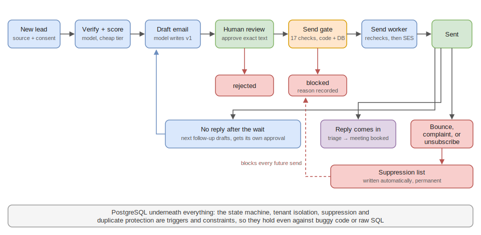
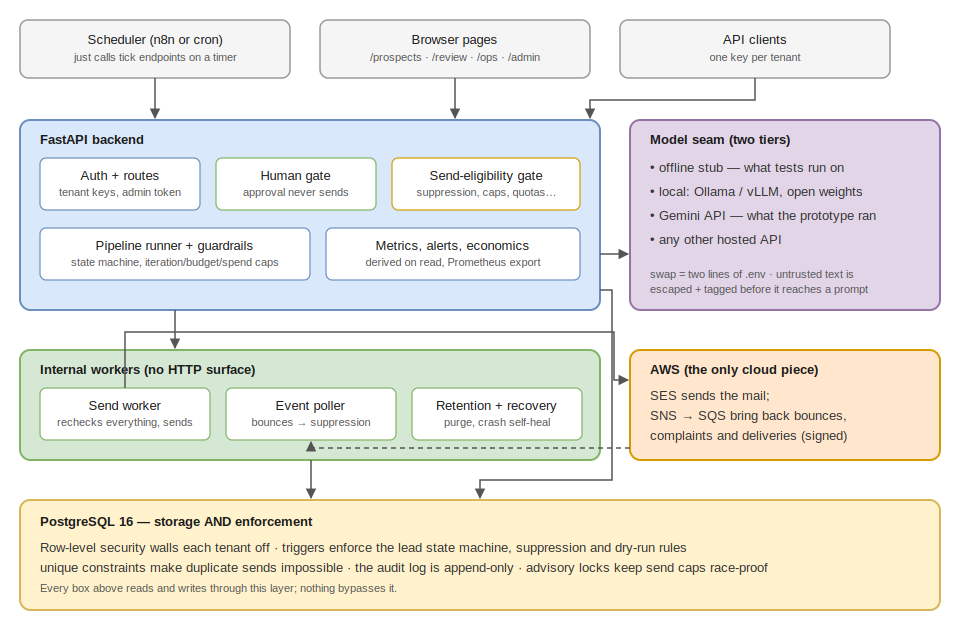
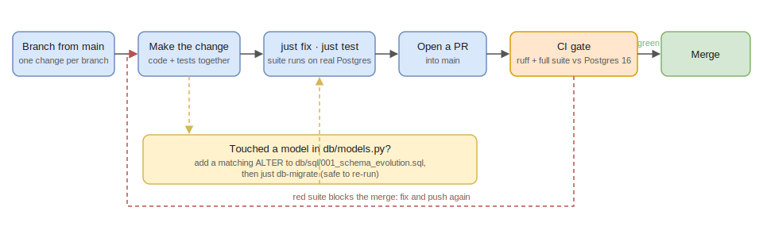
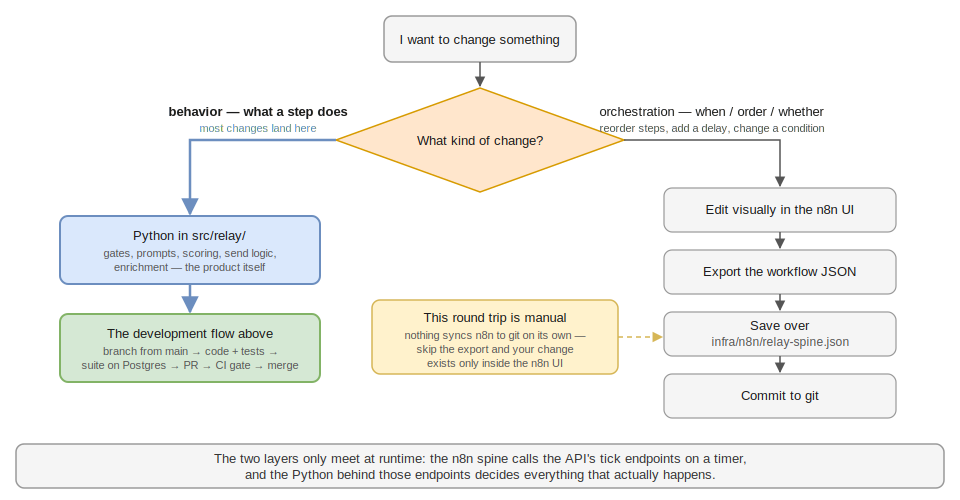

# RELAY

Cold outreach that runs itself, minus the ways it usually goes wrong.

RELAY takes a list of prospects and works the whole funnel: research and
scoring, a personalized first email, human sign-off, delivery, and
whatever comes back (replies, bounces, unsubscribes, booked meetings).
Language models do the repetitive thinking. A person approves every
email before it can leave. And the compliance rules live inside
PostgreSQL as triggers and constraints, so a duplicate send, or an email
to someone who unsubscribed, isn't a bug you hope to catch in review.
It's a transaction that can't commit.

## How a lead moves through it



Five rules shape everything in that picture:

1. **Approval and sending are separate.** A reviewer approves the exact
   final text, and that is all approval does. A separate worker executes
   sends later and re-checks every rule at that moment: suppression,
   caps, quotas, pacing, sender identity. Seventeen checks in real mode,
   mirrored by database triggers that don't trust the application code.
2. **Suppression is automatic and permanent.** A bounce, a spam
   complaint, or a one-click unsubscribe writes a suppression entry in
   the same transaction that records the event. Once an address is on
   that list, no code path can make it eligible again.
3. **The models have no authority.** They're stateless functions behind
   a swap-friendly interface. Text from the outside world (bios, web
   pages, replies) is escaped and wrapped in labeled
   `<untrusted_data>` blocks before it reaches a prompt, so a prospect
   whose bio says "ignore previous instructions" is just a prospect
   with a strange bio. Model output is data that the gates re-check;
   it can't send, approve, or unsuppress anything.
4. **Hard limits sit outside the smart parts.** Every pipeline run has
   an iteration cap, a budget ceiling, and a tenant-level monthly spend
   cap. Dumb counters, on purpose: they keep working when the clever
   component is the thing that broke.
5. **Everything leaves a trail.** Consequential actions land in an
   append-only, PII-redacted audit log. Erasure requests delete a
   person everywhere and leave exactly one thing behind: a hashed
   do-not-contact marker.

## Architecture



There isn't much to deploy. One FastAPI service, one Postgres database,
and a handful of internal workers that share the same codebase. The
scheduler is anything that can hit an HTTP endpoint on a timer (the
repo ships an n8n workflow, but cron works). AWS is only involved when
real mail moves: SES sends it, and a signed SNS-to-SQS loop brings
bounce and complaint events back. The three web pages (review queue,
ops dashboard, admin console) are plain HTML served by the API, no
build step.

The unusual choice is making Postgres the enforcement layer instead of
just storage. Tenant isolation is row-level security. The lead state
machine, the suppression checks, and the dry-run rules are triggers.
Duplicate protection is a unique constraint. The test suite runs
against a real Postgres and attacks those mechanisms directly, raw SQL
included, because mocks can't prove any of this.

For a deeper walkthrough of the runtime — the drivers, the state
machine as control flow, where crash-safety comes from, and the send
handoff — see [docs/control-flow.md](docs/control-flow.md).

## What's in the box

| Area | What you get |
| --- | --- |
| Pipeline | A 31-state lead machine, one transaction per step, crash recovery on every tick, resumable failures, and multi-step follow-up sequences where each step gets its own human approval |
| Review | A rubric for approve / edit / reject with reasons, an append-only review trail, a confidence-ordered queue, batch review, and edit-rate tracked as a metric |
| Sending | Transactional-outbox send jobs, race-proof daily caps with per-tenant overrides, hourly pacing and warmup ramps, per-tenant sender identities, and a last-hop recipient check at the provider boundary |
| Compliance | Lawful-basis and source provenance required at ingestion, a legal-preflight gate for real-person data, region rules as config, RFC 8058 one-click unsubscribe, DSR erasure, retention purge, and keyed email digests |
| Multi-tenancy | Row-level security everywhere, one-call tenant onboarding, per-tenant quotas and spend caps, cost-per-meeting economics, and a worker that drains tenants in parallel |
| Operations | JSON and Prometheus metrics, alert rules for spend spikes, failure streaks, stuck queues and bounce rates, an ops dashboard, an admin console, and structured logs that redact PII before writing |

The build history, phase by phase, is in
[docs/phase-history.md](docs/phase-history.md).

## Tech stack

- **Python 3.12**, FastAPI, Pydantic v2, SQLAlchemy 2, psycopg 3.
  [uv](https://docs.astral.sh/uv/) for dependencies,
  [just](https://just.systems/) as the command runner.
- **PostgreSQL 16**, doing double duty as described above.
- **Models are configuration, not code.** Run everything locally with
  any OpenAI-compatible server (Ollama, vLLM) so nothing leaves your
  machine, or point either tier at a hosted API. The prototype ran
  end-to-end on the Gemini API's free tier: Gemini Flash for drafting
  and triage, Gemma for scoring, total inference cost of zero. Tests
  run on a deterministic offline stub and never touch a provider.
- **Amazon SES** for real mail, with signature-verified SNS/SQS event
  ingestion. **n8n** as an optional scheduler. A one-way CRM mirror
  seam (EspoCRM adapter) that stays off the send path.

## Getting started

You need [uv](https://docs.astral.sh/uv/), [just](https://just.systems/),
and either Docker or a local PostgreSQL 16.

```bash
just sync                 # install dependencies
cp .env.example .env      # then edit values

# database, pick one:
just infra-up             # Docker: Postgres + Mailpit
just db-local-start       # no Docker: throwaway local cluster on :5433

just db-migrate           # schema + triggers + RLS + rule seeding
just demo                 # walk a synthetic lead through every state
just seed                 # seed and run a 20-prospect synthetic cohort
just test                 # full suite, incl. the exit gates
just api                  # FastAPI on :8000 (/docs, /review, /ops, /admin)
just worker               # one send-worker pass
just bench 2 10 4         # throughput benchmark: tenants, leads, concurrency
just stack-up             # optional: adds the n8n spine on :5678
```

`just demo` prints a full journey, every transition from `created` to
`closed`, with the human gate and the simulated send visible in the
trace. Nothing real can send out of the box: real mode sits behind a
config switch, an allowlist, operator attestations, and the SES
sandbox, all of which have to agree.

When you want to run it somewhere real rather than on a laptop,
[docs/deployment.md](docs/deployment.md) covers the process layout,
the port map, scheduling the workers, the reverse-proxy and TLS
requirements, and the SES wiring.

## Tests

331 tests, all against real PostgreSQL. The interesting ones are
adversarial: workers raced against each other to force duplicate sends,
raw SQL thrown at the triggers, prompt injection planted in prospect
bios, a crash forced mid-send, a backup restored to prove erasure
survives it. `just test-exit-gate` runs the subset that pins the
roadmap's exit criteria:

| Invariant | Where it's proven |
| --- | --- |
| A lead walks every state, fully traced | `tests/test_exit_gate_journey.py` |
| Runaway loops and budgets get killed | `tests/test_guardrails.py` |
| Duplicate sends can't happen, even raced | `tests/test_idempotency.py`, `tests/test_adversarial.py` |
| `dry_run` can't send, even via raw SQL | `tests/test_dry_run.py` |
| Tenants can't touch each other's data | `tests/test_tenant_isolation.py` |
| Suppressed addresses stay unreachable | `tests/test_suppression.py` |
| PII stays out of logs and audit rows | `tests/test_logging_and_audit.py` |
| No lead without lawful provenance | `tests/test_source_register.py` |
| Injection can't raise scores or fake intent | `tests/test_adversarial.py`, `evals/` |
| Erasure survives backup/restore | `tests/test_adversarial.py` |

## Repository layout

```
src/relay/
  api/            routes, auth, schemas, and the three HTML pages
  compute/        model backends behind the routing seam
  crm/            one-way CRM mirror (never on the send path)
  db/             engine, models, migrations, SQL (triggers, RLS)
  domain/         states, suppression, eligibility, approval, erasure
  evals/          golden-set checks for whichever models are configured
  guardrails/     iteration cap, budget ceiling, spend cap
  ingest/         SES/SNS events and one-click unsubscribe
  observability/  metrics and alert rules
  pipeline/       the runner: state walking, sequences, recovery
  routing/        task-to-tier routing
  senders/        simulated + SES senders
  synthetic/      Faker prospects, including hostile ones
  workers/        send worker, event poller, retention
tests/            the suite (needs a real Postgres)
docs/             status, decision records, phase history, diagrams
infra/n8n/        the scheduler workflow
scripts/          demo, seeding, evals, benchmark, local-Postgres helper
```

## Development

New to the codebase? [docs/onboarding.md](docs/onboarding.md) is a
guided ramp — a session-by-session reading path with exercises, from
`just demo` to the send path's five defense layers.



The loop for making a change:

1. Branch from `main`, one change per branch, PR back into `main`.
2. Code, then `just fix` (format + lint) and `just test`. The suite
   needs a running Postgres and resets its own `relay_test` database
   every run, so it can't touch your dev data.
3. Changed a model in `db/models.py`? Add a matching idempotent
   `ALTER` to `db/sql/001_schema_evolution.sql`. Table creation only
   covers brand-new tables; existing databases pick up new columns
   from that file. `just db-migrate` is safe to re-run any time.
4. Changed the state machine or a trigger? The SQL in `db/sql/`
   re-applies on migrate, and transition rules re-seed from the Python
   map in `domain/states.py`, which is the single source of truth.
5. Decisions worth remembering get a dated record in `docs/decisions/`.

CI (GitHub Actions) runs ruff and the full suite against a Postgres 16
service on every push; a red suite blocks the merge. Other useful
commands: `just test-exit-gate` for the invariant subset,
`just test-cov` for coverage, `just bench` to check a change didn't
slow the funnel down.

Three conventions matter more here than in most repos:

- Tests run against real Postgres on purpose. If you feel the urge to
  mock the database, the thing you're testing is probably one of the
  guarantees that only exists in the database.
- New safety behavior ships with an adversarial test that attacks it,
  not just a happy-path one.
- `.env` never gets committed, and every new setting gets a documented
  line in `.env.example`.

### Where a change lives



n8n owns orchestration: when steps fire, in what order, under what
conditions. The Python in `src/relay/` owns behavior: what every one
of those steps actually does. That split means most changes are
ordinary code changes that go through the loop above. Editing the
spine itself is the narrow case, and it's a manual round trip &mdash;
n8n doesn't sync to git, so the export back to
`infra/n8n/relay-spine.json` is on you.

## Where things stand

This is a working prototype. Every planned phase is built and tested,
and real emails have gone out through the SES sandbox with a human
approving each one. What's left before pointing it at real prospects
is operator work rather than engineering: legal artifacts, production
SES access, a secrets manager, a security review. The checklist, and
where each item plugs in, is in
[docs/prototype-status.md](docs/prototype-status.md). The roadmap and
full project documentation live on the `Plan` branch.
