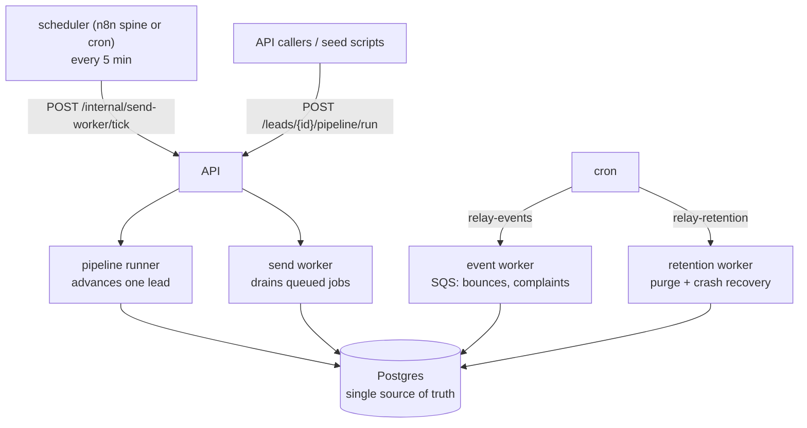
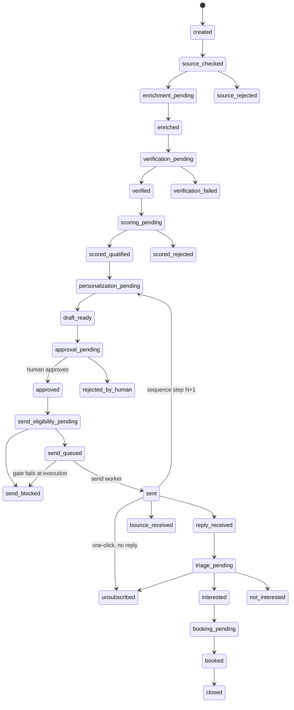
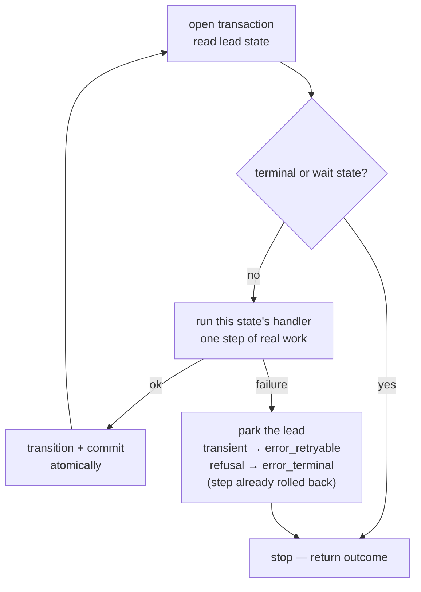
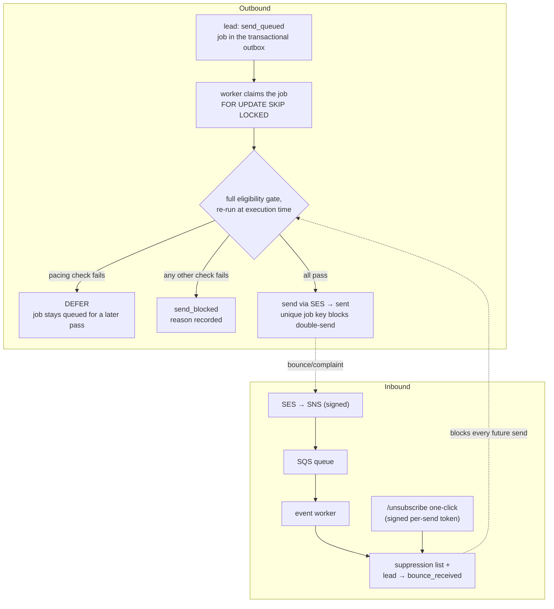

# How control actually flows

A reference for reading RELAY's runtime cold. Grounded in the real
code: `src/relay/pipeline/runner.py`, `src/relay/domain/states.py`,
`src/relay/domain/state_machine.py`, `src/relay/workers/send_worker.py`,
`src/relay/domain/eligibility.py`, and `infra/n8n/relay-spine.json`.
Diagrams here are Mermaid so they render on GitHub and stay diffable;
the reader-facing pictures live in the README.

## The one-sentence model

Control in RELAY is not a straight line of function calls. It is **a
lead walking through a state machine, pushed forward one step at a time
by independent drivers, with Postgres as the single source of truth.**

There is no central main loop. Each driver repeatedly asks the database
"what state is this lead in, and what is the one legal next step?" —
which is why the system survives restarts, audits cleanly, and can be
killed at any moment without corruption.

## Layer 1 — the drivers (who pushes the work)

- **No boss loop.** The drivers each do one job and coordinate only
  through the database. A lead's `state` column is effectively the
  program counter: a driver reads it, does the one step that state
  calls for, and writes the new state back. Nothing important lives in
  a process's memory.
- **The pipeline runner** advances a single lead as far as it legally
  can, per call (`POST /leads/{id}/pipeline/run`).
- **The send worker** is deliberately *not* a daemon: each invocation
  (`relay-worker --once`, or the tick endpoint) is one pass over
  pending jobs. Scheduling is the deployment's problem, and overlapping
  passes are safe (`FOR UPDATE SKIP LOCKED`).
- **The event worker** drains the SQS queue of bounce/complaint events;
  the same ingestion also has an SNS-push webhook form
  (`/webhooks/ses`).
- **n8n is just the timer.** The shipped spine is thin: every five
  minutes → `/health` → if healthy → poke the send-worker tick with the
  admin token. It is not in the data path; replace it with cron and no
  driver changes. Its one real value is visual, no-code editing of the
  schedule.

## Layer 2 — the lead state machine (the real control structure)

The pipeline runner is a dispatcher: it reads the lead's current state
and runs that state's handler. "What runs next" is decided entirely by
the state in the database. The full edge set is
`ALLOWED_TRANSITIONS` in `domain/states.py` — the single authority,
seeded into `lead_transition_rules` for the DB trigger to enforce.

Not drawn, but real: every active state also has edges to
`error_retryable` and `error_terminal`.

Two states are **stop points** where control deliberately leaves the
pipeline (`_WAIT_STATES` in the runner): `approval_pending` waits for a
human, `send_queued` waits for the send worker. The runner halts and
returns at both.

Key properties:

- **Illegal transitions are impossible two ways.** The edges are
  defined once in `states.py` and enforced both in Python
  (`is_transition_allowed`) and by a Postgres trigger
  (`fn_enforce_lead_transition`). Raw SQL cannot move a lead along an
  edge that doesn't exist.
- **Branch-offs are terminal.** `source_rejected`,
  `verification_failed`, `scored_rejected`, `rejected_by_human`,
  `send_blocked`, `bounce_received`, `unsubscribed`, `not_interested`,
  `closed`, `error_terminal` have no outgoing edges. That is how "do
  not contact" is permanent by structure, not by a flag someone might
  flip.
- **The error loop is capped in the database.** `error_retryable` may
  resume *only* into the state it errored from (`error_return_state`),
  and the trigger both counts retries against an immutable
  `max_retries` and rejects any other write to `retry_count`. A
  two-hop `X → error_retryable → Y` can't be used to skip pipeline
  steps.
- **The sequence loop re-enters the same machine.** After `sent`, if no
  reply arrives within the campaign's delay and steps remain, the lead
  moves back to `personalization_pending` for step N+1 — and the next
  draft gets its own human approval. Follow-ups reuse the machine
  rather than adding a second one.
- **State changes are atomic with their audit trail.** The transition,
  its trace row, and the audit entry commit in one transaction; a lead
  is never in a new state without the record of how it got there.

## Layer 3 — one tick of the runner (where crash-safety lives)

- **One step = one transaction.** A crash mid-run is harmless: the
  in-flight step rolled back and the lead sits in its last committed
  state. A recovery pass later re-runs anything left stale.
- **The loop is "advance until you can't".** One `run()` call walks a
  lead forward until a terminal state, a wait state, or a failure.
- **The guardrail harness wraps the loop from outside.** Every tick is
  counted and cost-billed against the run's iteration cap, budget
  ceiling, and the tenant's monthly spend cap. The kill decision sits
  outside the reasoning, so a confused model cannot spend its way past
  the limit.
- **Failures park the lead; they never crash the pipeline.** Transient
  errors (timeouts, 429s) park as `error_retryable` and resume later;
  hard refusals park as `error_terminal` for a human.

## Layer 4 — the send handoff and the feedback loop

The two things that happen outside the runner: the actual send (owned
by the send worker) and inbound events (owned by the event worker).

- **The send is a two-actor handoff, not one call.** The runner queues
  the job and stops; the worker — a different process — claims and
  executes it. A crash mid-send leaves the job claimed-but-unfinished,
  and recovery re-queues it.
- **The gate runs twice, and the second time is the one that counts.**
  Checked at `send_eligibility_pending`, then re-run *in full*
  immediately before the mail leaves. If the world changed between
  queue and execution — a bounce landed, the address was suppressed —
  the last-moment check catches it.
- **Failing is not always terminal.** Two pacing checks
  (`mailbox_hourly_pace_ok`, `send_spacing_ok` — `DEFERRABLE_CHECKS`
  in `eligibility.py`) defer the job to a later pass instead of
  blocking the lead. Everything else blocks, with the failing check
  named in the record.
- **The checklist itself lives in `eligibility.py`**: seven integrity
  checks that always run (suppression, lawful basis + region rules,
  approved-draft version match, tenant/mailbox integrity,
  real-person-data stop, idempotency) and ten more in real mode
  (the master switch, test-consent basis, the pilot allowlist —
  fail-closed, empty means nobody — sender configured / identity
  approved / domain authenticated / tenant identity attested,
  race-proof daily cap with warmup and tenant overrides, pacing,
  unsubscribe mechanism present). The database mirrors the
  load-bearing ones as triggers; the code list is the readable one.
- **Double-send is structural.** The unique key on send jobs means two
  workers racing the same job cannot both send — the second insert
  loses in the database, not in application logic.

## The safety properties, consolidated

- State lives in the DB, not memory → any process can die and restart;
  work resumes from the last committed state.
- Every step is atomic → no half-done steps, ever.
- Every transition is double-enforced (code + trigger) → illegal moves
  are impossible even via raw SQL.
- Terminal states have no exits → "do not contact" is permanent by
  structure.
- Hard caps wrap every run from outside the reasoning → no runaway
  loops or spend.
- Two deliberate stop points (human approval, send worker) → control
  leaves the pipeline only where intended.
- The eligibility gate runs at execution time → the final check
  reflects the world as it is, not as it was at queue time.
- Unique job keys → no double-sends, even raced.

## Key files

| Concern | File |
|---|---|
| State definitions + legal edges (the single authority) | `src/relay/domain/states.py` |
| The only path that changes a lead's state | `src/relay/domain/state_machine.py` |
| The per-lead control loop | `src/relay/pipeline/runner.py` |
| Send execution + execution-time re-check | `src/relay/workers/send_worker.py` |
| The pre-send checklist (incl. the deferrable set) | `src/relay/domain/eligibility.py` |
| Bounce/complaint ingestion | `src/relay/ingest/ses_events.py`, `src/relay/workers/event_worker.py` |
| One-click unsubscribe | `src/relay/ingest/unsubscribe.py` |
| Suppression | `src/relay/domain/suppression.py` |
| Iteration / budget / spend caps | `src/relay/guardrails/harness.py` |
| The scheduler spine (n8n export) | `infra/n8n/relay-spine.json` |
| Transition + retry-cap enforcement in SQL | `src/relay/db/sql/002_functions.sql`, `003_triggers.sql` |
